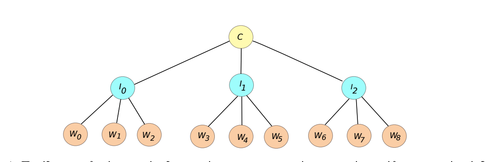

**NOTE :** *This repo , is a part of the 2nd Programming assignment that we had to implement for the course of Operating Systems - Fall 2020.*

 
 <h1>3 Level Interprocess Communication </h1> 

 

 
 

